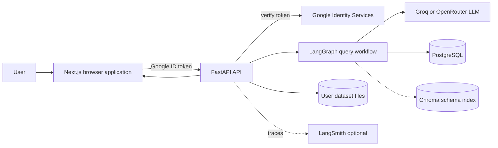
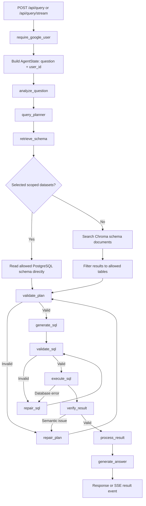
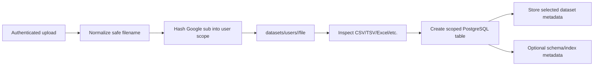

# Text-to-SQL Agent Architecture

This document describes the architecture currently implemented in this
repository. The application converts a user's natural-language question into a
read-only SQL query, executes it against PostgreSQL, and presents the result in
the Next.js interface.

## System context



## Repository structure

```text
text-to-sql-agent/
├── frontend/                  # Next.js UI and browser-side auth state
│   └── app/page.tsx           # Query, upload, results, history, analytics
├── backend/
│   ├── app/
│   │   ├── main.py            # FastAPI application and middleware
│   │   ├── api/routes.py      # Auth, query, schema, SQL, dataset endpoints
│   │   ├── agent/
│   │   │   ├── graph.py       # LangGraph topology
│   │   │   ├── nodes.py       # Workflow node implementations
│   │   │   └── state.py       # Typed workflow state
│   │   ├── database/
│   │   │   ├── connection.py  # SQLAlchemy engine/session
│   │   │   ├── schema.py      # Visible schema and user isolation
│   │   │   ├── executor.py    # Bounded SQL execution
│   │   │   └── dataset_intelligence.py
│   │   ├── rag/
│   │   │   ├── retriever.py   # Scoped schema retrieval
│   │   │   ├── vectorstore.py # Chroma access
│   │   │   └── ingest.py      # Schema index creation
│   │   ├── llm/               # Provider factory and prompts
│   │   ├── security/          # Google auth and SQL validation
│   │   └── config.py          # Environment-backed settings
│   └── tests/
├── datasets/                  # Runtime uploads; not committed
├── chroma/                    # Local persistent vector store
├── database/                  # Local database artifacts
├── docker-compose.yml         # Local PostgreSQL/backend/frontend stack
└── render.yaml                # Render backend deployment definition
```

## Main query flow



The streaming endpoint emits progress events for workflow nodes and then a
final result event. The regular endpoint waits for the complete graph run.

## Dataset ingestion and isolation



The authenticated Google `sub` is normalized to `user["id"]`. A stable hash of
that identifier creates the filesystem and table namespace:

```text
datasets/users/<user_scope>/
dataset_<user_scope>_<dataset_name>
```

Every schema lookup receives the authenticated user ID. User-owned dataset
tables are included only when their scope matches that ID. Built-in demo tables
are intentionally shared. Manual SQL execution uses the same filtered schema
before validation, so a user cannot query another user's uploaded table through
the API.

For an active selected dataset, retrieval bypasses Chroma and reads the
authenticated user's scoped database schema directly. This avoids stale or
cross-user vector results. Chroma is used for general schema retrieval when no
selected dataset is available; returned documents are filtered against the
allowed table set.

## LangGraph components

| Node | Responsibility |
| --- | --- |
| `analyze_question` | Normalize and classify the question |
| `query_planner` | Produce a structured table/column plan |
| `retrieve_schema` | Provide relevant, user-scoped schema context |
| `validate_plan` | Check planned tables and columns |
| `generate_sql` | Ask the configured LLM for PostgreSQL SQL |
| `validate_sql` | Reject writes, multiple statements, comments, unknown identifiers, and unsafe patterns |
| `repair_plan` / `repair_sql` | Bounded self-correction using validation or execution feedback |
| `execute_sql` | Run validated read-only SQL with result limits |
| `verify_result` | Detect empty, inconsistent, or semantically incorrect results |
| `process_result` | Normalize rows, columns, metadata, and timing |
| `generate_answer` | Convert the result into a natural-language response |

The graph uses `MemorySaver` with a generated request thread ID. Retry and
correction limits are controlled by environment settings such as
`MAX_SQL_RETRIES` and `MAX_CORRECTION_ATTEMPTS`.

## Security boundaries

1. Google ID tokens are verified by the backend against `GOOGLE_CLIENT_ID`.
2. Protected endpoints derive the user identity from the verified token, not
   from a request body field.
3. Dataset paths and PostgreSQL table names are user-scoped.
4. Schema discovery and manual SQL validation use the authenticated user's
   allowed tables and columns.
5. SQL validation runs before execution and rejects write operations and
   unsafe or unsupported statements.
6. Results are capped by `MAX_RESULT_ROWS`.
7. LLM credentials remain server-side environment variables; they are never
   sent to the browser.

## Deployment topology

### Local Docker Compose

```mermaid
flowchart TB
    F[frontend:3000] --> B[backend:8000]
    B --> P[(postgres:5432)]
    B --> C[/chroma volume]
    B --> D[/datasets volume]
    B --> L[LLM provider]
```

`docker-compose.yml` starts PostgreSQL first, then seeds the database, ingests
schema documents, and starts Uvicorn. The frontend is built with the backend
URL supplied through `NEXT_PUBLIC_API_URL`.

### Hosted deployment

```text
Browser
  └── Vercel: Next.js frontend
        └── Render: FastAPI backend container
              ├── Neon/PostgreSQL: DATABASE_URL
              ├── Google: ID-token verification
              └── Groq/OpenRouter: SQL and answer generation
```

The Render service is defined in [`render.yaml`](./render.yaml). The frontend
must point `NEXT_PUBLIC_API_URL` at the deployed backend, and the backend
`CORS_ORIGINS` must include the deployed frontend origin.

## Request and data contracts

### Authentication

```text
POST /api/auth/google
{ "credential": "<Google ID token>" }
→ { "user": { "id", "name", "email", "picture" } }
```

### Query

```text
POST /api/query
Authorization: Bearer <Google ID token>
{ "question": "Show the top restaurants by rating" }
```

`POST /api/query/stream` returns Server-Sent Events with progress updates and a
final result payload.

### Dataset lifecycle

```text
POST /api/datasets/upload
GET  /api/datasets
POST /api/datasets/select
POST /api/datasets/index
GET  /api/schema
```

The uploaded Zomato CSV is treated like any other user dataset: it is stored
under the authenticated user's scope, inspected, loaded into that user's
scoped PostgreSQL table, and exposed to the query workflow only after selection.

## Operational considerations

- Persist PostgreSQL data with a managed database or a durable Docker volume.
- Persist dataset files if uploads must survive container restarts.
- Persist or rebuild Chroma consistently with the configured embedding provider.
- Set `GOOGLE_CLIENT_ID`, `DATABASE_URL`, `CORS_ORIGINS`, and the selected LLM
  API key in the deployment environment.
- Do not commit `.env`, API keys, uploaded datasets, Chroma databases, or local
  database files.
- Use `/health` for backend readiness checks.

